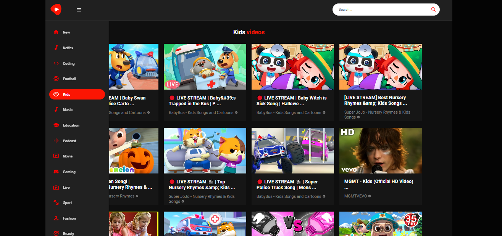

# YOUTUBE CLONE

## Projeto usando React

## Link: https://douglasmonteirodev.github.io/builds/youtube-clone/

 

      

## Objetivo

### Foi criar um site similar ao youtube com algumas particularidades diferente do original.

## Descrição

- `Há um campo de busca`
- `Possivel reproduzir qualquer video do YT`
- `Totalmente responsivo`

# Douglas Monteiro ❤😎
